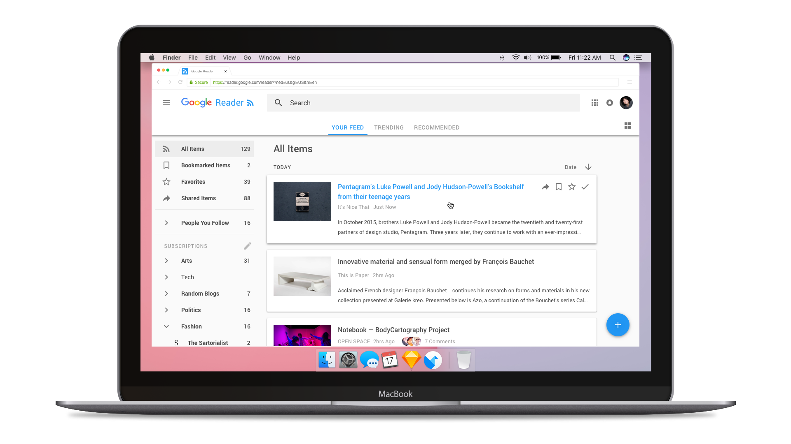
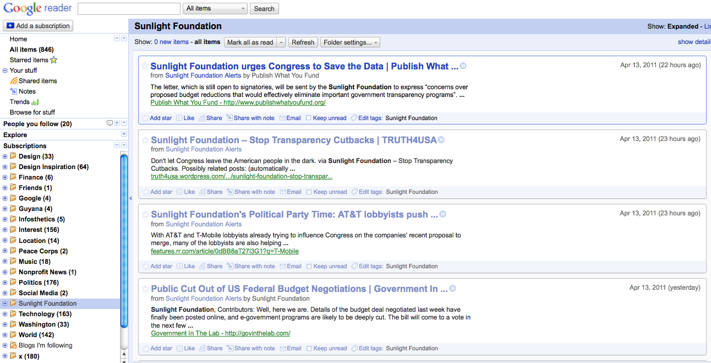
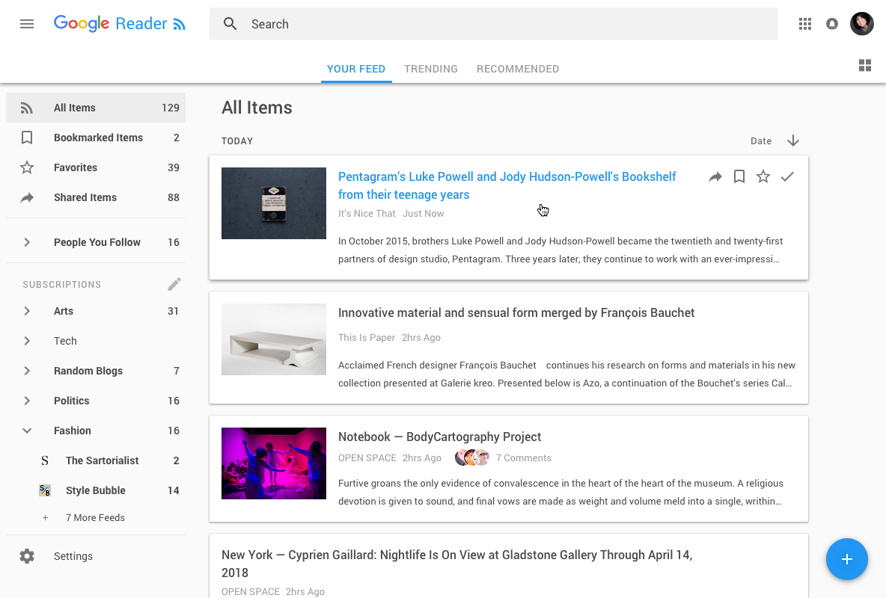
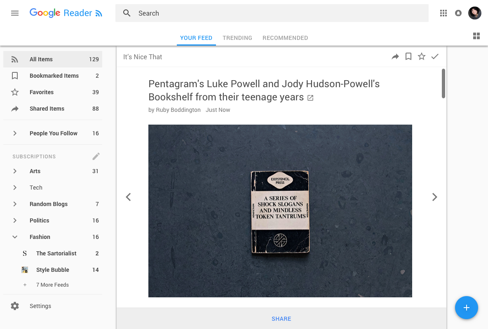
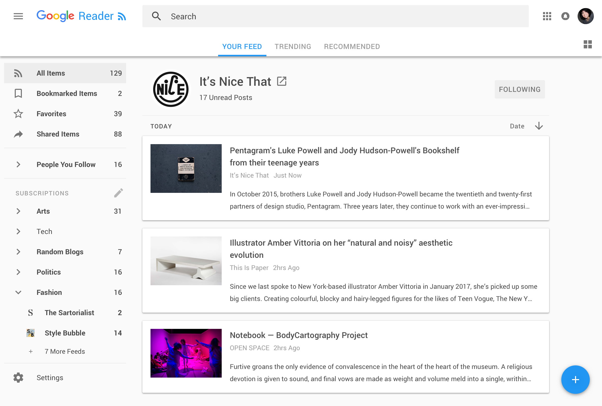
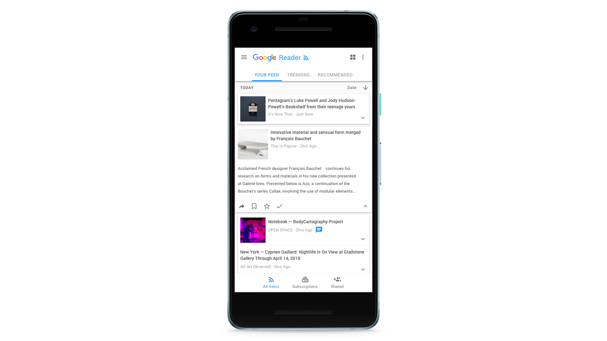

I don’t think I’m alone in still, intermittently, mourning the untimely demise of [Google Reader](https://www.youtube.com/watch?v=VSPZ2Uu_X3Y). 
Most recently the loss hit me, as random thoughts often do, in the shower -- this time while listening to the news surrounding the #deleteFacebook movement. 

“Walled gardens,” I thought to myself, “Phooey! I miss Reader!” 

####Digression

(Okey I’m aware a Google product isn’t exactly the paradigm of the open internet but c’mon Reader’s format wasn’t exactly the panopticon that FB has become)

######Vintage Reader

I use the comparison between Reader and FB so readily because I’ve always considered GR to be closest thing we’ve come to a social network par excellence. Interacting with my friends over common interests, finding new, delightful discoveries by way of a shared blog post, or sharing an interesting post myself were my favorite features of the platform and set GR apart from competitors like Feedly or Old Reader. The baked-in base of gmail users and the pre-established ‘connections’ of their contact list rendered the friend-finding stage moot. **End Digression**

Anyway, with the memory of Google Reader fresh in my head mixed with news of an ever trending abandonment of social networks I reached my pinnacle shower thought of the day - “Say! What a great moment for Google to bring back Reader!” And apparently I [wasn’t](https://www.wired.com/story/rss-readers-feedly-inoreader-old-reader/) [alone](https://news.ycombinator.com/item?id=16721690). 

(Of course, from a privacy standpoint, I can understand the counter position that offering a Google product as an alternative to Facebook is like jumping from the frying pan to the fire, but maybe if we think about Facebook like a farm, sowing data from its users, perhaps we could think of GR as the free range alternative)

Sadly, I can only guess why GR was sunset to begin with and smarter people than I have made a [great many](https://www.quora.com/Why-did-Google-kill-Google-Reader) [informed](https://www.wired.com/2013/06/why-google-reader-got-the-ax/) [hypothesis](https://news.ycombinator.com/item?id=12485166) as to why the plug was pulled. Furthermore, I don’t have the kind of perspective or insight that would allow me to model a case arguing for Google to reboot the best thing it ever canned. So I won’t.

####However - 
What I CAN do as a product designer is entertain a thought experiment for how GR could look if it were reborn today and given a [Material Design](https://material.io/) treatment. So I present to you the culmination of a lost weekend -- 

###Google Reader 2018
####Home screen 

######Google Reader Home
I looked to Google News, Google Docs, and Feedly for layout inspiration while of course scouring the web for old screen shots of Google Reader. _Side Note_ I was shocked at how dated the interface had already become in the span of 5 years. I guess Gmail still looks the same though, so I shouldn't be that shocked. 

####Reading an article

######Reading an article
I've always loved Inbox's solution to opening an email using a modified [expansion panel](https://material.io/guidelines/components/expansion-panels.html#) with a sticky header and footer for longer messages. I thought a similar approach would work nicey here

####Blog Home

######Drilling down into an article
For a blog's homepage I drew inspiration from the layout of a [landing page for a Youtube channel](https://www.youtube.com/channel/UCJkMlOu7faDgqh4PfzbpLdg). I think if I were to spend more time iterating on these (I probably won't but I lowkey kind of want to) I'd do a few more examples of these publisher home pages. I think here would be a nice opportunity to pull some unique styling from a site's API: some branded color, a custom header, icon. Perhaps certified publisher's could even take ownership of their feed, it'd be magical.

####Mobile

######Mobile view 
Of course, its 2018: the mobile experience would have to be killer. I can't remember if a responsive version of reader was ever shipped but I'm 90% there never was one... 

