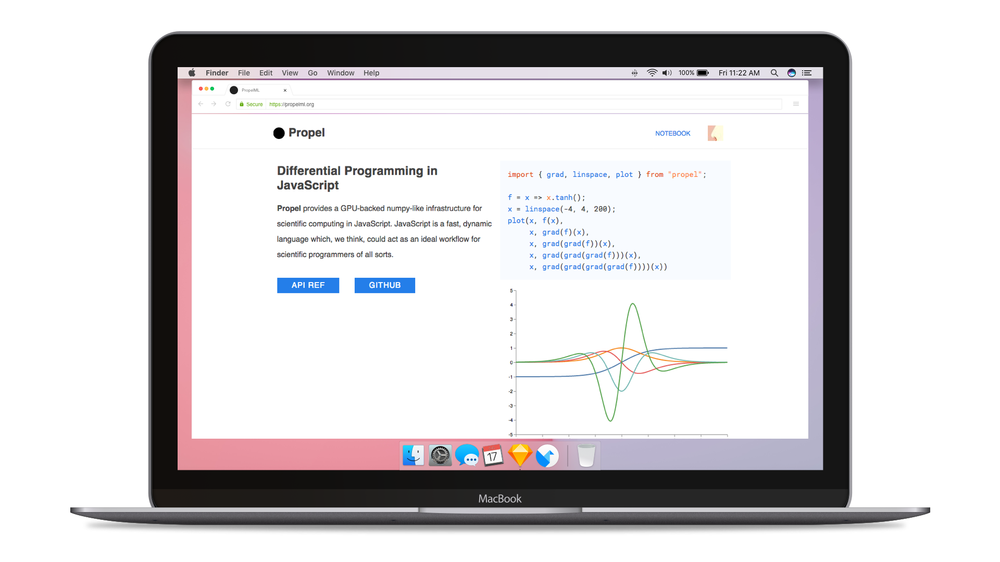
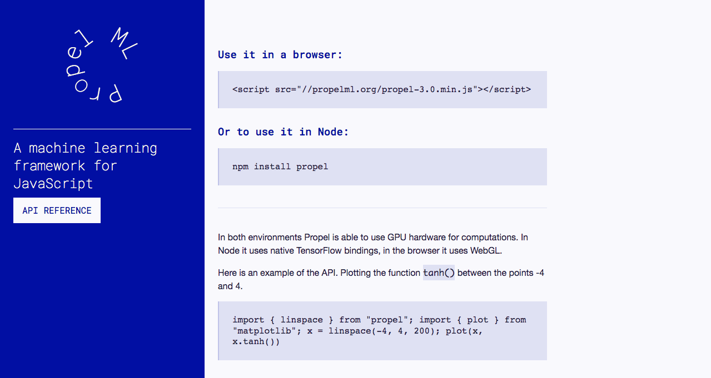
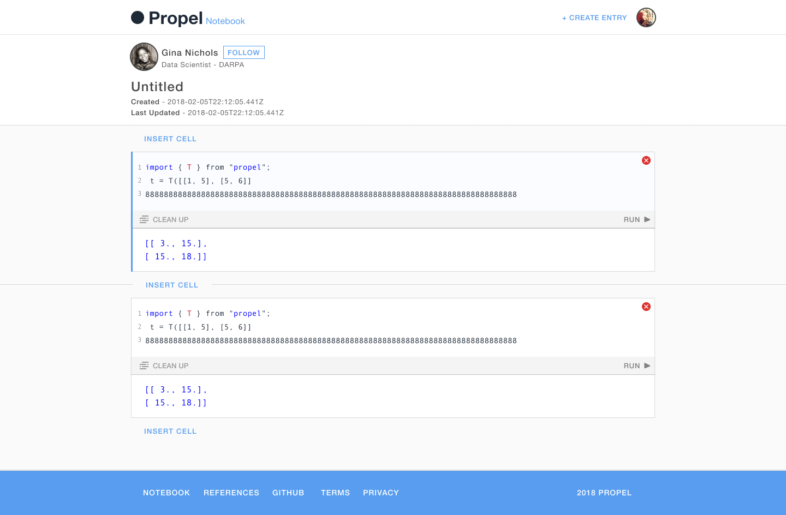
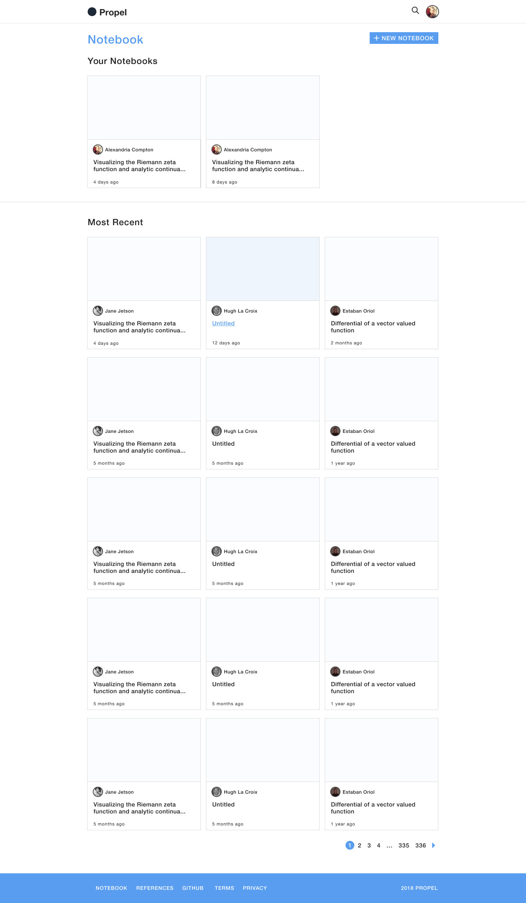

######The PropelML landing page, today.

####PropelML

My friend [Ryan](http://tinyclouds.org/) had been working on [a project](http://propelml.org/) for a few months in stealth mode when I asked to see how it was going. He presented his working demo that had little to no design applied: just a couple input fields and a link to a github repo. The math was way over my head but his enthusiasm got me excited too -- I wanted in. 

####Unsolicited Design Proposal

######My initial design proposal for Propel. It's still live [here](http://prop.beto.town).

I took a weekend and whipped together a [surprise unsolicited redesign](http://prop.beto.town) because everyone loves an unsolicited redesign of thier work, what could go wrong? Luckily Ryan was into it and brought me on to be in charge of the front end. 

######The Notebook - a code sandbox tool that lets you run machine learning scripts in the browser, something hitherto impossible before Propel. 

Since there’s no dedicated front-end developer I’m expected to code the designs I propose which has been a great “throw the kid into the deep end” experience - learning about project architecture, adapting to [unfamiliar frameworks](https://preactjs.com/), becoming less of a [git buffoon](https://github.com/propelml/propel/graphs/contributors) - so many lessons learned. 

######The Notebook Gallery

####Update - 

On April 19th we had to shudder our proverbial doors since Google released what was essentially [a direct competitor](https://medium.com/tensorflow/introducing-tensorflow-js-machine-learning-in-javascript-bf3eab376db). Big bummer but I can personally say I learned A LOT during my time with the project. 

On to the next side project... 
