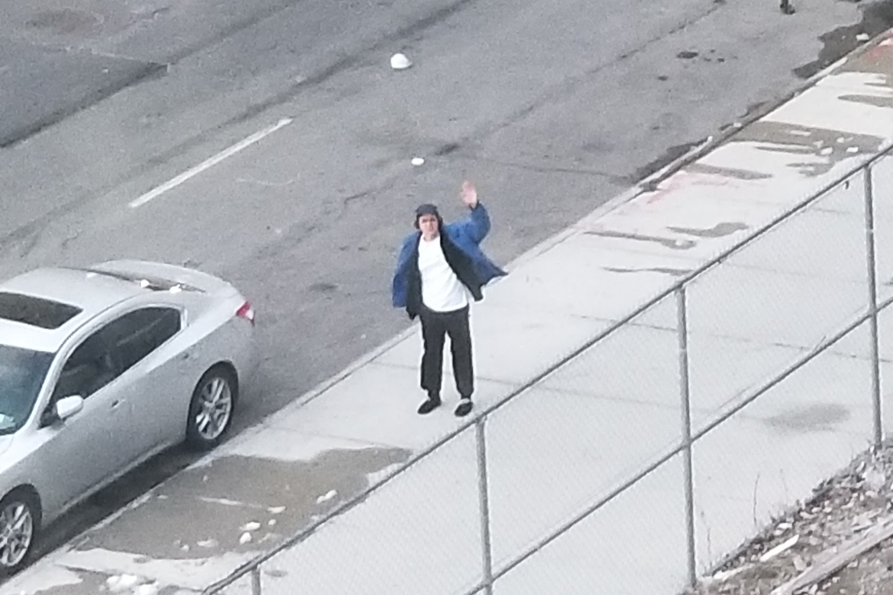

Hi, I'm **Roby Saavedra**. 

I’m a product designer living in NYC with about 5 years design experience. I’ve worked in branding, advertising, illustration, and more, but my heart is in software. I'll spare you a manifesto about my design beliefs except to say that I value <strong>accessibility</strong> in design above most everything else. 

---

###Some Random Facts

* I enjoy recording mixes and [posting them on Soundcloud](https://soundcloud.com/betobetobetobeto)
* I've been collecting [soul 45s](https://www.youtube.com/watch?v=33Rg1QSW5Qg) for way too long and have been a podcast guest in that capacity a [couple](https://soundcloud.com/thevinylexam/episode-113-the-beto-review) of [times](https://soundcloud.com/thevinylexam/episode-01). 
* [Here's a book of mine](https://www.printedmatter.org/catalog/43118/) that's on sale at Printed Matter.
* I built this site using [Gatsby](https://www.gatsbyjs.org/) and [Netlify](https://www.netlify.com/). [Clone it here why don'tcha?](https://github.com/yungbeto/portfolio) 
* If still, 5 bullets deep, you're looking for more information [take a look at my CV](https://www.dropbox.com/s/foq2ngw2gjhf0i6/saavedra_CV.pdf?dl=0). 

