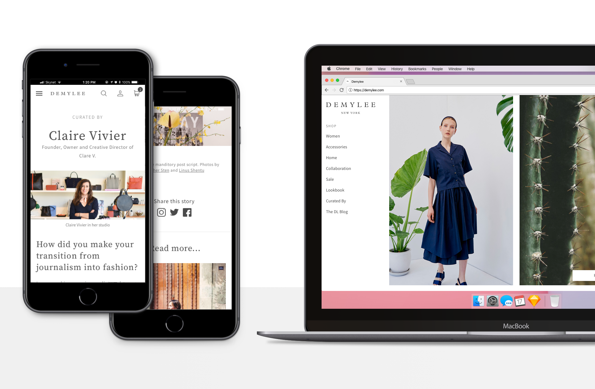
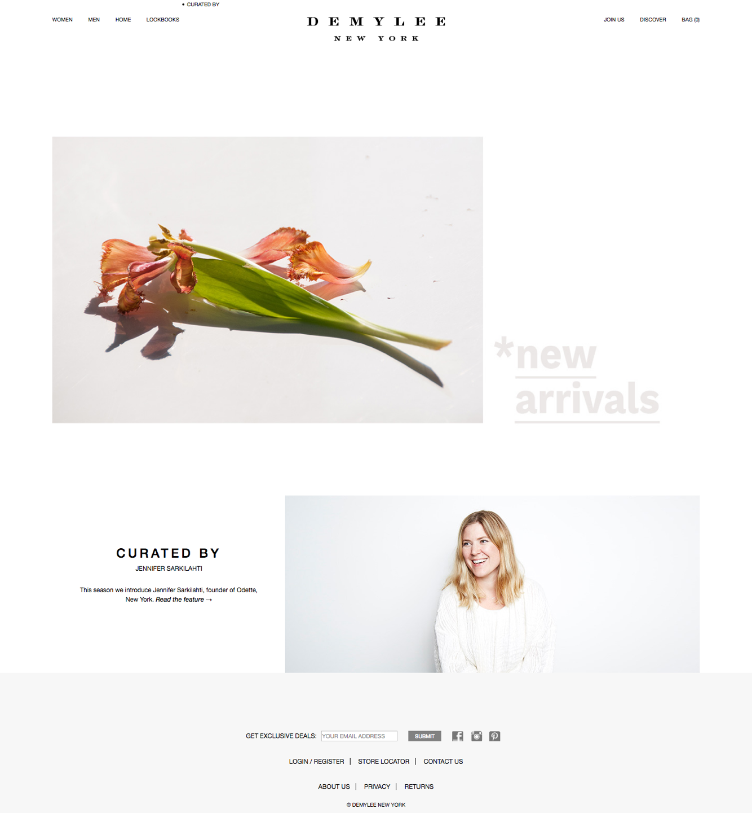
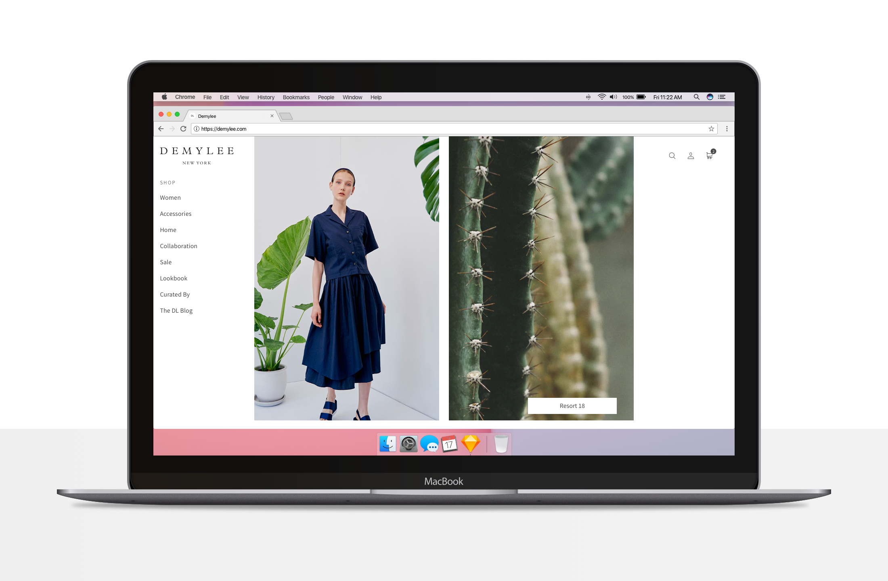
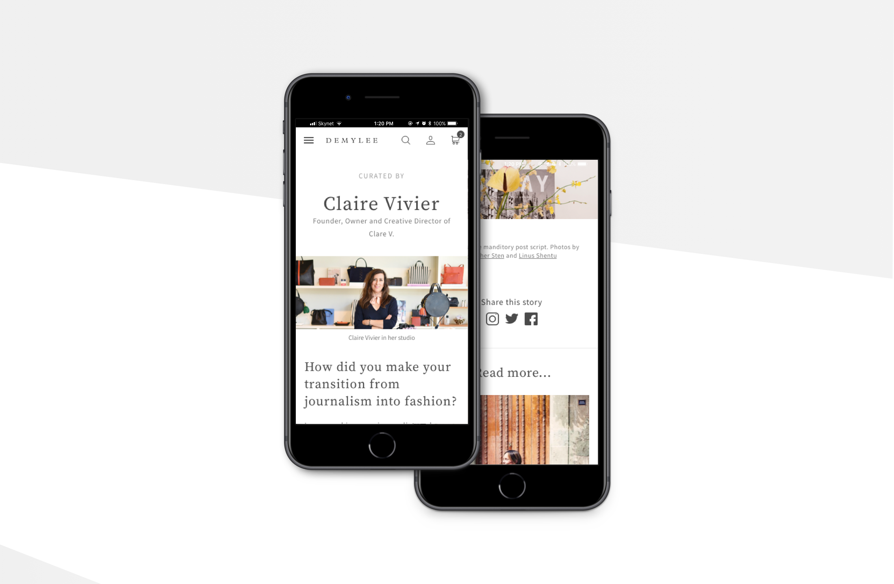
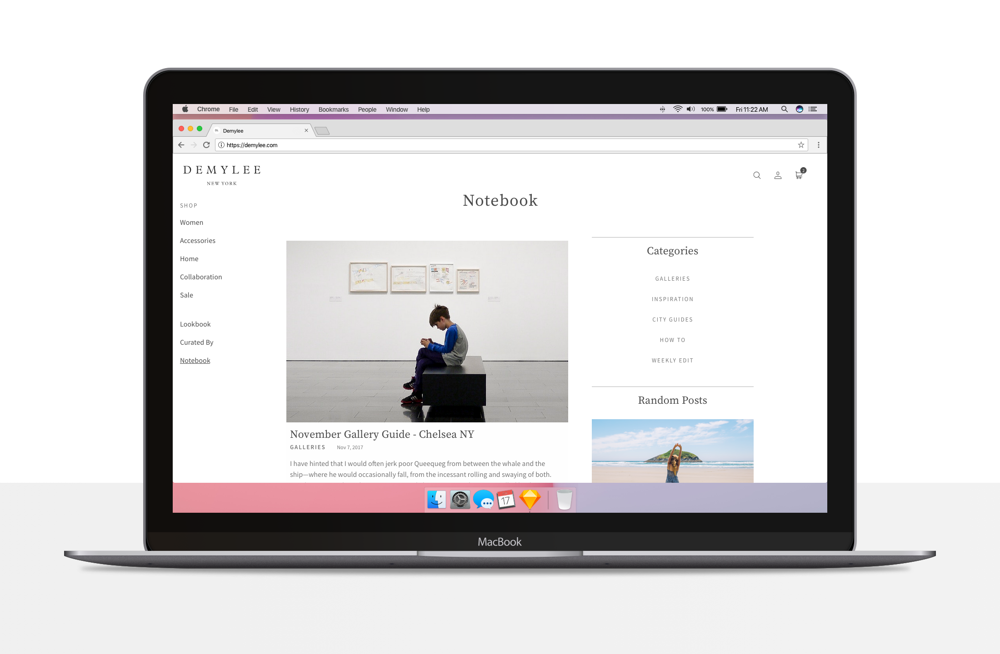
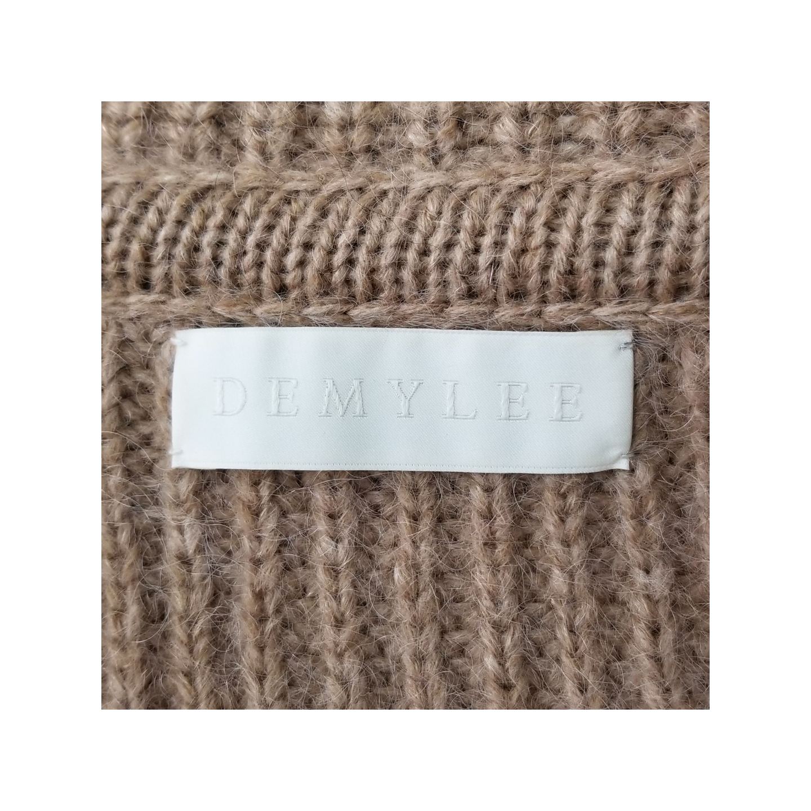
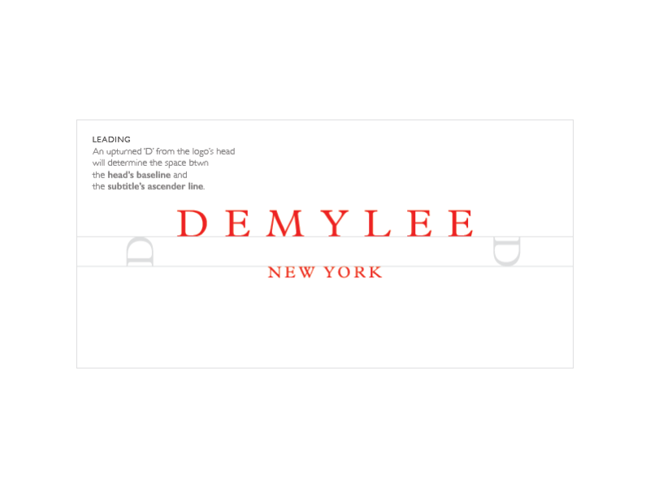

######The new Demylee site

I was recently approached by the New York knitwear brand [Demylee](https://www.instagram.com/demyleeny/) to redesign their aging online store, craft a new company blog, and update their logo. It was clear that the company wasn't looking for a drastic rebranding, rather a deep scrub to bring the shine out of what they knew was working. 

##Knit Picking

######The old Demylee site

Demylee makes stylish, unique clothes that attract young, professional women with discerning taste. It was important that their web presence be every bit as elegant as the clothes the company produces.

The previous site was running a convoluted amalgamation of WP plugins making it really difficult for anyone to come in and manage. My first order of business was to convince the team that they should invest in a Shopify account - which they did - and get a good developer to start on the right foot - which they also did. Hooray!

##Sew Much Work

######The new landing page

Nights and weekends for the next couple of months were dedicated to this site. I worked closely with a really talented developer to get the site up in time for an upcoming season. 

######The mobile experience was improved from it's previous level of 'non-existent'

######The new blog

##Branding

######A fresh, redesigned sweater label

On top of the UI work I was doing I also had the privilege to breathe new life into the company's logo. I took the opportunity to switch the font to [Palantin](https://www.myfonts.com/fonts/mti/plantin/) whose light elegance I felt better represented the brand's ethos.

