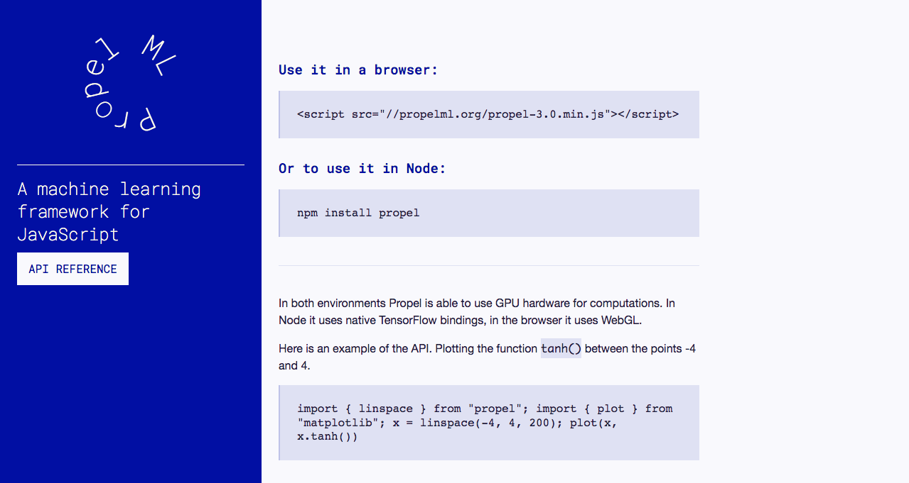
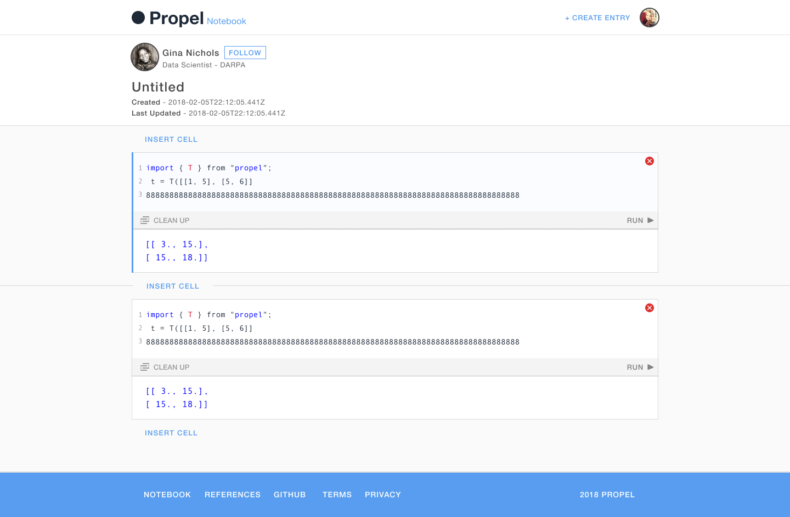
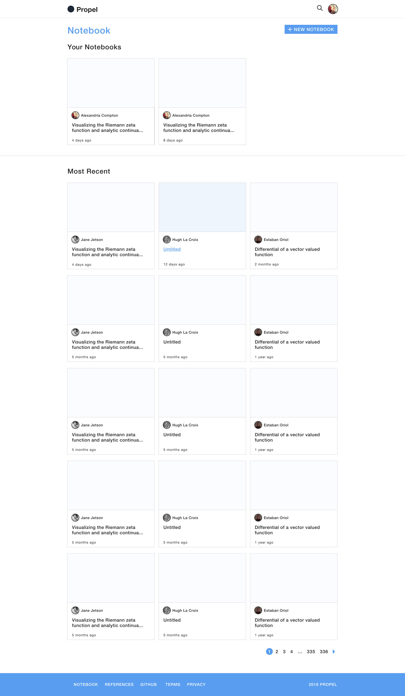

######The PropelML landing page, today.

####PropelML

Only a few weeks prior to its planned initial rollout, [Propel](http://propelml.org/) had a quickly thrown together landing page and UI. 

####Unsolicited Design Proposal

######My initial design proposal for Propel. It's still live [here](http://prop.beto.town).

I took a weekend and whipped together a [surprise unsolicited redesign](http://prop.beto.town) because everybody loves it when you imply that their website sucks. The bait was bitten and since then I’ve been the de facto design lead for the open source project. 

######The Notebook - a code sandbox tool that lets you run machine learning scripts in the browser, something hitherto impossible before Propel. 

Since there’s no dedicated front-end developer I’m expected to code the designs I propose which has been a great “throw the kid into the deep end” experience - learning about project architecture, adapting to [unfamiliar frameworks](https://preactjs.com/), becoming less of a [git buffoon](https://github.com/propelml/propel/graphs/contributors) - so many lessons learned. 

######The Notebook Gallery
