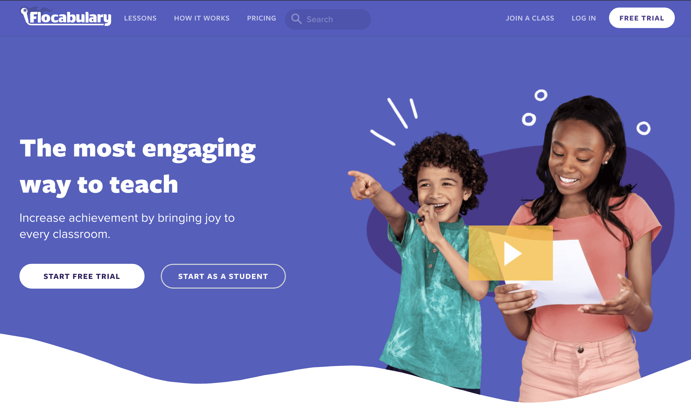

####Flocabulary

Earlier this year (2018) I accepted a product design position with Flocabulary, an ed tech company that uses hip hop to engage classrooms. So far it's been a really rewarding experience building a product that truly benefits students and helps them succeed. It's also been a totally unique design challenge to make products that appeal to humans half my age - lots of great learning experiences so far!

Of course I can't share work here but am happy to discuss upon request. 
