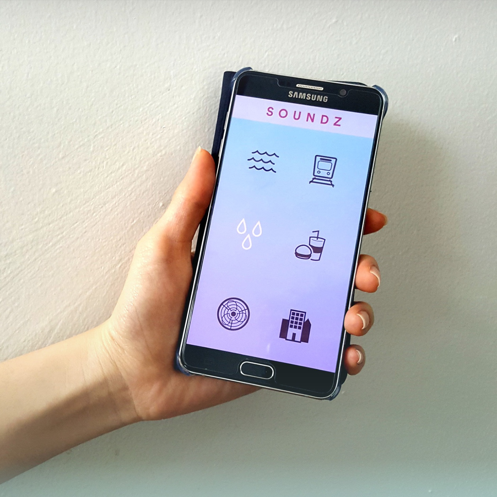
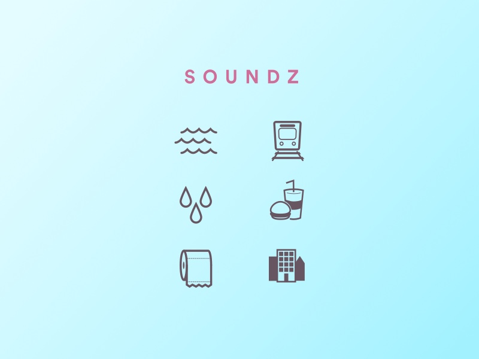

######The Soundz App
Soundz is an app I designed and developed from scratch basically just to see if I could actually do it. The idea was to create a resource for background, ambient noises to help people focus or achieve maximum chill.

The process was like any other - designing the app and assets in Sketch and then developing the software in [Lua](https://www.lua.org/) using the framework [Corona](https://coronalabs.com/product/) which is usually used for developing mobile games. 

######Iconography sample

The app is [still live in the Android store](https://play.google.com/store/apps/details?id=net.prblmslvng.soundz) though I don't think you'll be able to get [the iOS version](https://itunes.apple.com/us/app/soundzzz/id1118282439?ls=1&mt=8) any longer since I haven't revisited the project in a couple of years. 

